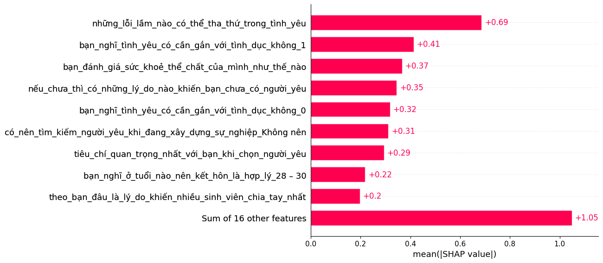

# Interpretation Report — Label A

**Model file:** `model_A.pkl`

**Source data file (for reference):** `\mnt\data\love_survey_responses.xlsx`

## Top features (from feature_importance.csv)

- **bạn_đánh_giá_sức_khoẻ_thể_chất_của_mình_như_thế_nào**: importance=0.000000

- **bạn_cảm_thấy_ngoại_hình_của_mình_như_thế_nào**: importance=0.000000

- **bạn_có_cảm_thấy_áp_lực_từ_gia_đình_hoặc_xã_hội_về_việc_phải_có_người_yêu_không**: importance=0.000000

- **tình_yêu_ảnh_hưởng_đến_kết_quả_học_tập_sự_nghiệp_ở_mức_độ_như_thế_nào**: importance=0.000000

- **bạn_cảm_thấy_gia_đình_có_ảnh_hưởng_đến_mối_quan_hệ_của_bạn_như_thế_nào**: importance=0.000000

- **xu_hướng_tính_dục_của_bạn_là_Dị tính**: importance=0.000000

- **bạn_có_mong_muốn_tìm_được_người_yêu_trong_tương_lai_gần_không_0**: importance=0.000000

- **bạn_có_mong_muốn_tìm_được_người_yêu_trong_tương_lai_gần_không_Chưa chắc**: importance=0.000000

- **có_nên_tìm_kiếm_người_yêu_khi_đang_xây_dựng_sự_nghiệp_Không nên**: importance=0.000000

- **có_nên_tìm_kiếm_người_yêu_khi_đang_xây_dựng_sự_nghiệp_Nên**: importance=0.000000

- **nên_chi_tiêu_bao_nhiêu_hàng_tháng_cho_việc_hẹn_hò_500.000 đồng - 1.000.000 đồng**: importance=0.000000

- **nên_chi_tiêu_bao_nhiêu_hàng_tháng_cho_việc_hẹn_hò_Trên 1.000.000 đồng**: importance=0.000000

- **bạn_nghĩ_tình_yêu_có_cần_gắn_với_tình_dục_không_0**: importance=0.000000

- **bạn_nghĩ_tình_yêu_có_cần_gắn_với_tình_dục_không_1**: importance=0.000000

- **bạn_nghĩ_ở_tuổi_nào_nên_kết_hôn_là_hợp_lý_25 – 27**: importance=0.000000

- **bạn_nghĩ_ở_tuổi_nào_nên_kết_hôn_là_hợp_lý_28 – 30**: importance=0.000000

- **bạn_nghĩ_ở_tuổi_nào_nên_kết_hôn_là_hợp_lý_Trên 30**: importance=0.000000

- **nếu_chưa_thì_có_những_lý_do_nào_khiến_bạn_chưa_có_người_yêu**: importance=0.000000

- **tiêu_chí_quan_trọng_nhất_với_bạn_khi_chọn_người_yêu**: importance=0.000000

- **bạn_đã_từng_thử_tiếp_cận_tình_yêu_qua_cách_nào**: importance=0.000000

## SHAP plots

## Local explanations (examples)

## Notes

- If SHAP was not available, fallback permutation importances were used.

- SHAP computation can be slow depending on model complexity and sample size.
